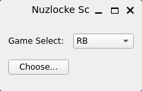
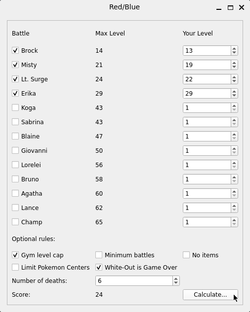

# Nuzlocke Scorer
## Master the Challenge!
___

This app can help quantitatively evaluate a Nuzlocke run.
As of now, the app is based off the mainline Pokemon games.

---

### How to use

After booting up you'll see this:



This menu allows you to choose what game you are basing your run on.

Once you select from the dropdown menu, click "Choose..."

You will see a new window that looks like this.

.

Each major battle shows that highest level Pokemon they have. 

If you win a battle, click the battle you just won and input the highest level Pokemon you had in the battle.

At this time, every battle has a 10 point base that is modified with the difference 
between the highest-level Pokemon on each side. 
Example from above, I defeated Brock with a party of maximum level 13.
10 + (14 - 13) = 11

Below the battles are optional rules that can be enabled to apply a 1.1x multiplier.

Finally, there is the number of Pokemon that have been killed in action. As of this version, 
this is the only factor that deducts points (5 points per casualty).

When all is said and done, click the "Calculate..." button and receive a final score.

---

### How to install

Clone:
```commandline
git clone https://github.com/drachelehre/nuzScorer
cd nuzScorer
```

Set up a virtual environment (You only need to do this step once):
```commandline
python3 -m venv venv 
```

Activate:
Linux
```commandline
source venv/bin/activate
```

Windows
```commandline
.venv\Scripts\activate.ps1
```

Make sure you have PyQt6 installed while environment is active:
```commandline
pip install pyqt6
```

Once everything is installed and running, run the script:
```commandline
python main.py
```